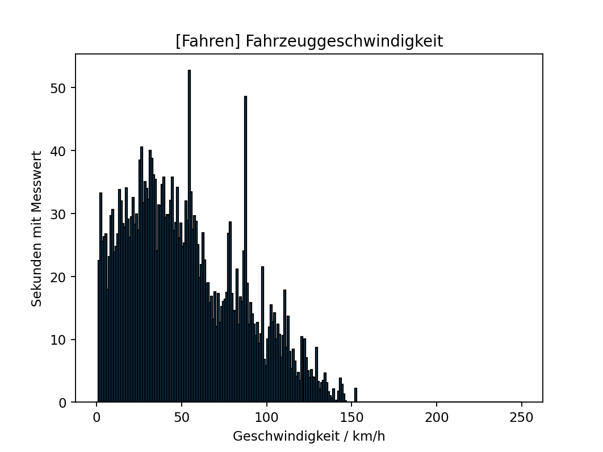
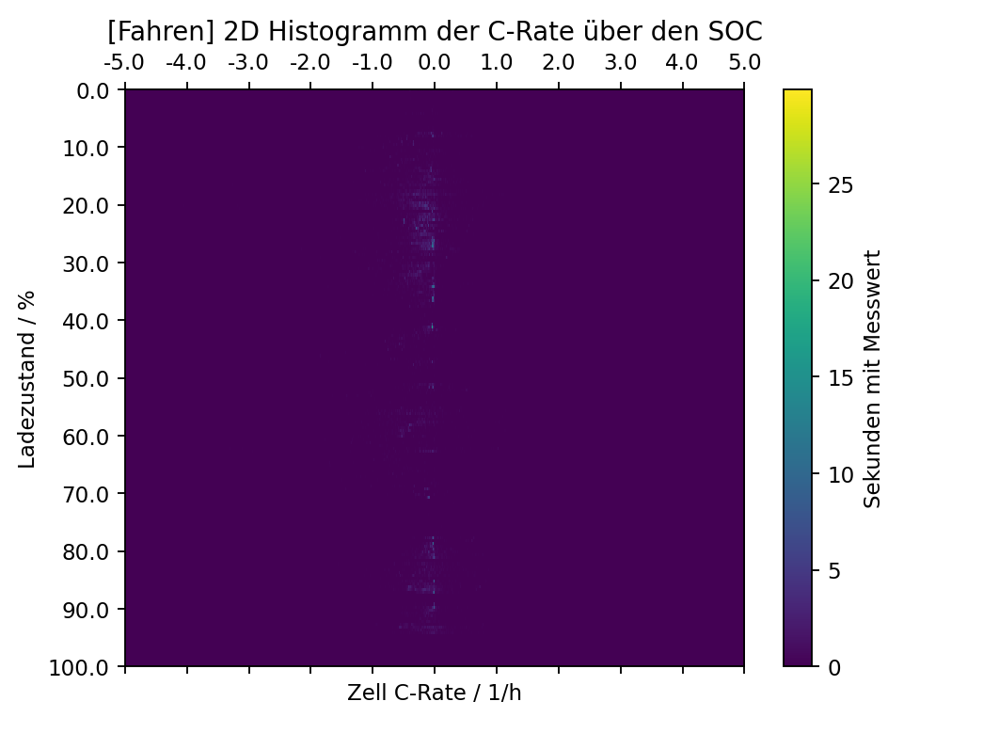
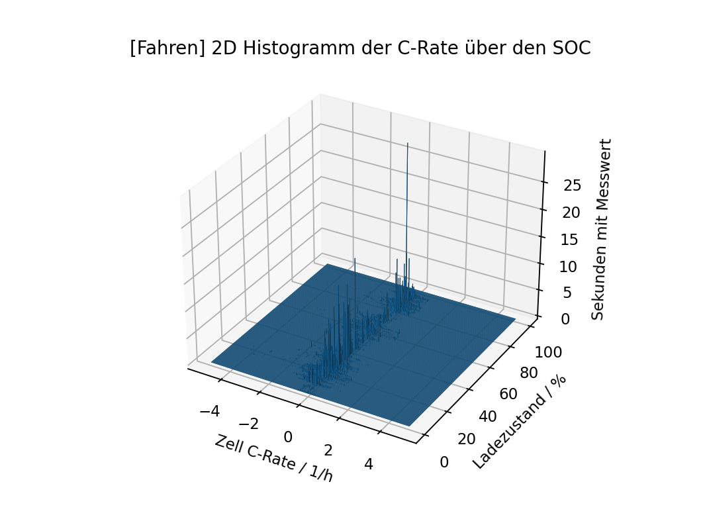

# track_ev_metadata - FTM track evaluation tool

Goal of this tool is to postprocess data from the 'mobtrack' database of the Institute of Automotive Technology (FTM) of the Technical University of Munich (TUM). It evaluates every captured track and charging process of the to be postprocessed defined vehicles. The tool consists of two main parts, the database evaluation and the postprocessing. The database evaluation calculates histograms for each track and saves them to the database. The postprocessing combines the calculated histograms of each car to one histogram of a kind for each car. A list of all available histogram types and examples can be found below.

## Authors

The tool was developed by Lukas Leonard Koening during his time as a reseach assistant at the FTM.

Contact:
lukas.koening@tum.de or via Markus Schreiber (PHD candidate @ FTM).
## Acknowledgements

Thanks to Georg Balke for his support regarding the database. 

Thanks to Markus Schreiber for his input into the tool and support during the development.

## Example results
Example of 1D Histogram | Example of 2D Histogram, 2D plotted | Example of 2D Histogram, 3D plotted
:-------------------------:|:-------------------------:|:-------------------------:
  |    | 

## Environment Variables

To run this project, you will need to add the following environment variables to your .env file or environment setup:

- `host`: URL to the mobtrack database
- `db_user`: Username of a database account with read access to the track scheme and read and write access to the tables `charging_ev_histograms`, `histogram_bins` and `track_ev_histograms`
- `db_pwd`: Password of the aforementioned user.

For the previous three variables contact the administrator of the mobtrack database.

- `log_path`: Path where you want to save the log files. The logs will be saved in the `logs` folder, but if you want to add a second location, add it here.

## Future ToDo's
This tool works as it is. But there is some room for improvement, e.g. but not limited to:
- The road type feature is not implemented right now. For this a map matching of the tracked GPS locations must be implemented. Open Street Map seems a good kick-off-point. This would allow to evaluate for example the c-rate for different types of roads.
- A propper preprocessing of the data (smoothing, removal of unreasonable outliers etc.) should be implemented to enhance the quality of the results.
- The postprocessing could be expaneded for further needs.
## Documentation

The code should be documented very well by itself. Below you can find some instructions how to get started.

### How to run the code

Inside the `main.py` file, you can find an example how the database evaluation workflow should look like. There is also an example how to run a postprocessing for a vehicle (commented out).

To run the code properly you have to set the environment variables and connect to the FTM VPN (either by a work PC or via eduVPN).

### Important classes
#### Vehicle
The Vehicle class describes a vehicle in the database. A vehicle is defined by its ID in the database, a name and its capacity of the high voltage battery.

#### Bins
The Bins object describes the bins of a histogram. It consists of maximum, minimum and stepsize.

#### Histogram
The Histogram class describes a histogram. Histogram objects are defined by their datatype (see database for more details) and their road type (UNKNOWN, CITY, COUNTY, HIGHWAY, COMBINED). The road type feature is not implemented until now (February 2023). Furthermore a Histogram object can contain counts and a Bins object. The Histogram class also implements functions to calculate the counts from given data, plot the histogram and save it as a pickle file.

#### Histogram2D
Like the basic Histogram class the Histogram2D class describes a histogram, but with two different types of data and the combined counts. Sometimes this type of histogram is also called 3D histogram. The structure is the same as the Histogram class but with two datatypes and Bins objects for the two axis. There are also two different plotting functions for 2D and 3D plotting.

#### Track
The Track class implements all needed functions and informations needed, to process the test drive. It inherits from the BEVUsage class. For more details checkout the code.

#### Charging
The equivalent of the Track class for charging processes. Please checkout the code for more details.

### Important functions
#### process_new_tracks(vehicle: Vehicle, desired_track_histograms, desired_charging_histograms)
This function does all the work to evaluate all new tracks and charging processes of the given vehicle `vehicle`. To define, which Histograms should be created, one has to set the two variables `desired_track_histograms` and `desired_charging_histograms`. Both must be lists of `HistogramType` objects. To calculate all implemented histograms, use following command:

``process_new_tracks(vehicle, Track.IMPLEMENTED_HISTOGRAMS, Charging.IMPLEMENTED_HISTOGRAMS)``

`HistogramType` is a enum defined in `BEVUsage.py` describing all implemented types of histograms. A full list of all implemented histograms can be found below.

#### postprocess_vehicle(vehicle: Vehicle, track_hist_types, charging_hist_types)
This function postprocesses all previously calculated histograms of a vehicle and saves them to `output/[vehicle_ID]`. The inputs are the same as the one from the function `process_new_tracks`.

### Implemented histogram types
The list below lists all implemented histogram types that can be calculated by the tool (by February 2023). 
- CELL_C_RATE
- PACK_TEMP_MAX
- PACK_TEMP_MIN
- PACK_TEMP_DELTA
- PACK_SOC
- PACK_DOD
- VEHICLE_SPEED
- TRACK_DURATION
- IDLE_PERIOD_DURATION
- PACK_VOLTAGE
- CELL_VOLTAGE_MAX
- CELL_VOLTAGE_MIN
- CELL_VOLTAGE_DELTA
- AMBIENT_AIR_TEMP
- COOLANT_TEMP_INVERTER_INLET
- PACK_COOLANT_TEMP_INLET
- PACK_COOLANT_TEMP_OUTLET
- HEATPUMP_POWER
- ROTOR_REAR_TEMP
- STATOR_REAR_TEMP
- INTERIOR_TEMP
- PTC1_CURRENT
- PTC2_CURRENT
- PTC_VOLTAGE
- REAR_INVERTER_TEMP
- TRAVELED_DISTANCE
- AUXILIARIES_POWER
- PTC1_POWER
- PTC2_POWER
- C_RATE_PEAK_ANALYSIS_AMPL
- C_RATE_PEAK_ANALYSIS_FREQ
- HIST2D_C_RATE__PACK_TEMP_MAX
- HIST2D_C_RATE__PACK_TEMP_DELTA
- HIST2D_C_RATE__PACK_SOC
- HIST2D_C_RATE__VEHICLE_SPEED
- HIST2D_PACK_TEMP_MAX__PACK_SOC
- CHG_POWER
- CHG_HIST2D_POWER__PACK_TEMP_MAX
- CHG_HIST2D_POWER__PACK_TEMP_DELTA
- CHG_DURATION
- CHG_HIST2D_POWER__SOC
- CHG_EOC